# VHS Upscale

AI-powered VHS restoration and 4x upscaling pipeline. Takes PAL DV-captured VHS tapes (720x576i) and produces clean 2880x2304p 50fps HEVC output using GPU-accelerated deinterlacing, neural network denoising, and AI upscaling.

Runs on [Runpod](https://www.runpod.io/) GPU pods or any NVIDIA GPU with Docker.

## Pipeline

```mermaid
flowchart LR
    A["AVI Input\n720x576i 25fps"] --> B["Source Decode\nbestsource/ffms2"]
    B --> C["Chroma Shift\nfmtconv"]
    C --> D["QTGMC\nbob → 50fps"]
    D --> E["BleedOut\nchroma fix"]
    E --> F["NLM Denoise\nchroma UV"]
    F --> G["SCUNet\nluma denoise"]
    G --> H["2x VHS2HD\n720→1440"]
    H --> I["2x SPAN\n1440→2880"]
    I --> J["CAS + BT.709\nsharpen"]
    J --> K["HEVC Encode\nMKV output"]
```



**Source material:** PAL DV-captured VHS -- 720x576i, 25fps, BFF, SAR 16:15 (4:3 display), DV codec in AVI container.

## Quick Start

```bash
docker pull ghcr.io/viktorstiskala/vhs-upscale:cu128

docker run --gpus all -v /path/to/files:/workspace \
    ghcr.io/viktorstiskala/vhs-upscale:cu128 \
    upscale.sh /workspace/input.avi /workspace/output.mkv --chroma-shift -3
```

The user-provided model `2xVHS2HD-RealPLKSR.pth` must be placed in `/workspace/models/` before running.

## Usage

```bash
upscale.sh input.avi [output.mkv] [options]
```

| Flag | Default | Description |
|------|---------|-------------|
| `--chroma-shift` | `0` | Chroma shift correction in pixels (typical PAL VHS: `-3`) |
| `--cas` | `0.4` | CAS sharpening strength (`0.0` = off, `1.0` = max) |
| `--denoise` | `3.0` | NLM chroma denoise strength |
| `--crf` | `20` | x265 CRF (lower = higher quality, bigger file) |
| `--preset` | `slow` | x265 preset (slower = better compression) |
| `--threads` | auto | VapourSynth thread count |
| `--skip-upscale2` | off | Skip second upscale (output 1440x1152 instead of 2880x2304) |
| `--field-order` | `auto` | Field order: `auto`, `bff`, `tff`, `progressive` |

## Multi-GPU

For pods with multiple GPUs, `batch_upscale.sh` distributes files across GPUs:

```bash
batch_upscale.sh /workspace/input /workspace/output --chroma-shift -3
```

See [docs/MULTI-GPU.md](docs/MULTI-GPU.md) for details on GPU scheduling, environment variables, and resume support.

## AI Models

| Model | Purpose | Scale | Included |
|-------|---------|-------|----------|
| SCUNet (color_real_psnr) | Luma denoising | 1x | Built into image |
| BleedOut Compact | VHS chroma bleed/rainbow fix | 1x | Built into image |
| 2xLiveActionV1 SPAN | General-purpose upscaler (pass 2) | 2x | Built into image |
| **2xVHS2HD-RealPLKSR** | **VHS-specific upscaler (pass 1)** | **2x** | **User-provided** |

Place `2xVHS2HD-RealPLKSR.pth` in `/workspace/models/` on the pod.

## Output

- **Resolution:** 2880x2304p (or 1440x1152 with `--skip-upscale2`)
- **Frame rate:** 50fps progressive (bob deinterlace from 25fps interlaced)
- **Codec:** HEVC (libx265) in MKV, 10-bit YUV420
- **Audio:** FLAC (lossless copy from source)
- **Aspect ratio:** 4:3 (SAR 16:15 preserved)
- **File size:** ~35-55 GB per 3hr tape at CRF 20

## Docker

Pre-built image:

```bash
docker pull ghcr.io/viktorstiskala/vhs-upscale:cu128
```

Build from source (uses multi-stage parallel build with BuildKit):

```bash
docker buildx build -t ghcr.io/viktorstiskala/vhs-upscale:cu128 --load .
```

CUDA 13.0 variant:

```bash
docker buildx build \
    --build-arg CUDA_TAG=13.0.2-cudnn-devel-ubuntu24.04 \
    --build-arg CU_TAG=cu130 \
    -t ghcr.io/viktorstiskala/vhs-upscale:cu130 --load .
```

### Supported GPUs

| GPU | Architecture | VRAM |
|-----|-------------|------|
| A100 SXM/PCIe | Ampere (SM80) | 80 GB |
| H100 SXM/PCIe | Hopper (SM90) | 80 GB |
| RTX 5090 | Blackwell (SM120) | 32 GB |
| RTX Pro 6000 | Blackwell (SM120) | 96 GB |
| RTX 4090 | Ada (SM89) | 24 GB |

## Documentation

- [Pipeline details](docs/PIPELINE.md) -- 10-step restoration process explained
- [Multi-GPU batch processing](docs/MULTI-GPU.md) -- parallel processing across GPUs
- [Runpod deployment](docs/DEPLOYMENT.md) -- pod setup, templates, cost estimates
